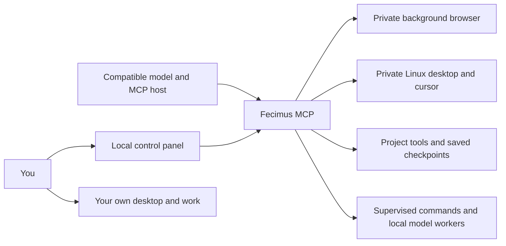

# Fecimus MCP 3

**One integration. An independent workspace for a compatible local model.**

Fecimus 3.0.0 connects your model to a background browser, its own Linux desktop and cursor, project editing, supervised commands, and optional local model workers. **All 84 previous tools remain available; 15 additions bring the full catalog to 99.** The default compact mode advertises five entry tools, so a small model can discover relevant schemas as it works instead of receiving the entire catalog at once.

Your chosen host supplies the main conversation and model. Fecimus supplies tools and a local control panel; it does not bundle model weights or require an OpenAI subscription.



## Download and install

| Platform | Archive | After extracting the complete archive |
| --- | --- | --- |
| Ubuntu LTS / Linux Mint XFCE | [Fecimus 3.0.0 for Linux](https://github.com/NermalYT/fecimus/releases/download/v3.0.0/Fecimus-3.0.0-Linux-Ubuntu-LTS.tar.gz) | Read `START_HERE.md`; open `INSTALL_FECIMUS.sh` for graphical setup |
| Windows 11 Pro / Pro N | [Fecimus 3.0.0 for Windows through WSL2](https://github.com/NermalYT/fecimus/releases/download/v3.0.0/Fecimus-3.0.0-Windows-11-Pro-WSL2.zip) | Read `START_HERE.md`; run `INSTALL_FECIMUS.cmd` |

Both packages contain the same source and tools with different launchers and starter instructions. Compare the archive with the release's [SHA256SUMS](https://github.com/NermalYT/fecimus/releases/download/v3.0.0/SHA256SUMS). Each package includes a file manifest. Dependencies and models are downloaded separately; first setup needs internet access.

Linux supports Ubuntu 22.04, 24.04, and 26.04 LTS and declared derivatives, including Linux Mint XFCE. Windows support is **Windows 11 Pro/Pro N through an initialized WSL2 Ubuntu LTS distribution**. Read the [Linux starter](platform/Linux/README.md) or [Windows starter](platform/Windows/README.md) for prerequisites. Windows 10, other Windows editions, WSL1, macOS and non-Ubuntu Linux remain outside this release's support policy.

The launcher stages a fresh source copy, installs dependencies, verifies startup, and prints the LM Studio configuration backup. It replaces the six original Fecimus registrations while preserving unrelated integrations. Restart LM Studio, choose a compatible model, and enable **mcp/fecimus**. LM Studio's tool-permission settings still apply.

## First use

Ask your model to call `fecimus_status`, then `fecimus_help`. The five initial tools are:

| Entry tool | Purpose |
| --- | --- |
| `fecimus_tools` | Search capabilities and retrieve exact argument schemas |
| `fecimus_call` | Invoke a discovered tool through its original validation and execution path |
| `fecimus_status` | Check available tools, runtime health, activity and connections |
| `fecimus_control_panel` | Return your private local control-panel link |
| `fecimus_help` | Read workflow, browser, desktop, studio or compatibility guidance |

For example, call `fecimus_tools` with `{"query":"project read edit"}`, then invoke a discovered tool:

```json
{"tool":"fecimus_project_read","arguments":{"path":"/home/yourname/Projects/Game/README.md"}}
```

That object is the input to `fecimus_call`. It returns the original tool result, including images where supported. Set `FECIMUS_TOOL_MODE=full` in Fecimus's launch environment, or `"tool_mode":"full"` in its settings file, and restart Fecimus to advertise all 99 tools directly. Compact discovery reduces schema overhead; it does not change your model's inference speed or reasoning ability.

## Keep control while the model works

Open the link returned by `fecimus_control_panel`. It shows activity, job/agent state and a **read-only view of Fecimus's desktop**. Capture once, or enable the optional viewer that refreshes every two seconds while the page is visible. It sends no mouse or keyboard input. Hiding the panel stops its polling and captures; Fecimus's browser, desktop and jobs continue running.

**Pause** blocks new controlled tool calls. Existing jobs and model requests can continue. **Stop** also requests cancellation of active calls, supervised jobs and local agents; it does not undo completed edits or guarantee an already dispatched external action has stopped. Resume when you are ready. These are cooperative controls, not a security sandbox.

Keep the session link private. With Node/npm available, run `npm run control` from an Fecimus source directory in Linux or WSL to print the current link while Fecimus is running. No model API is needed to use the panel. [Platform and networking details](docs/PLATFORMS.md#compact-mode-and-the-control-panel).

## What you can do

- **Browse while working fullscreen.** Fecimus reads its own loaded tabs beyond the viewport, captures full pages, and scrapes up to eight URLs with three concurrent page loads. Its browser profiles are separate from your personal tabs and cookies.
- **Develop projects directly.** Search text, read line ranges and file hashes, apply one unique literal replacement, create files without overwriting an existing path, and inspect staged/unstaged Git diffs. [Project workflow and concurrency limits](docs/STUDIO.md#inspect-edit-and-verify-a-project).
- **Use studio applications.** Discover Blender, Unity, Godot and development runtimes with `fecimus_app_probe`; launch Linux apps on Fecimus's private display; observe state and run up to 12 grounded desktop actions in one batch.
- **Run builds, tests and renders.** `fecimus_job_start` returns a job ID promptly; status and cancellation stay available during long work. Two jobs run concurrently by default, with lower CPU scheduling priority where available.
- **Keep explicit checkpoints.** `fecimus_workspace_notes` stores project notes across restarts, with revision checks on updates and deletes. Ask the next session to read its checkpoint. Chat history and model memory are not copied automatically.
- **Start an optional local worker.** `fecimus_agent_start` runs a bounded model/tool loop against a running loopback LM Studio API, using an explicit model and tool whitelist. Inspect it with `fecimus_agent_status` and cancel with `fecimus_agent_cancel`. [Setup and limits](docs/STUDIO.md#optional-local-model-workers).

MCP guide resources and the `fecimus_development` / `fecimus_studio` prompts are available to hosts that expose them. `fecimus_help` provides essential guidance when the host has no resource or prompt picker.

## Customize Fecimus and add tools

Ask your model to read `fecimus_help` with topic `upgrading`, then discover `fecimus_service`. It reports the active installation path, makes private source backups, checks edits and stages official releases. Your model can modify local source using the project tools; changes load after restarting the integration. Conflicts are preserved for review, and local work is never automatically published. Follow the [upgrade and rollback guide](docs/UPGRADING.md).

Use `fecimus_addons` to inspect and manage explicitly trusted local extensions. Each addon supplies namespaced tools through the same Fecimus switch after restart. Start with the [addon creation and installation guide](docs/ADDONS.md) and the [working example](examples/hello-addon). Users can optionally [share an addon](addons/README.md) through the repository's submission area. Addons are executable code with your user's access; their tools and local copies remain separate from official source updates.

## Choose a compatible model

Use the [38-model selection guide](docs/MODELS.md) and [machine-readable catalog](docs/models.json). Entries distinguish documented runtime/tool support, vision capabilities and candidates; **they are not Fecimus certifications or inference benchmarks**. Quantization, prompt template, runtime version, RAM/VRAM and context size all affect results.

Text tool models can browse DOM text, edit files and run commands. Screenshot interpretation requires a vision-capable model and a host that forwards image results. Check a loaded model's basic function calling with:

```bash
node scripts/check-model.mjs --model "YOUR_EXACT_LOADED_MODEL_ID"
```

This optional check needs the local LM Studio API and uses a harmless synthetic function. Ordinary MCP use does not require that API. The optional local worker does: its inference requests use only loopback endpoints, attach no API key and do not silently retry failed actions. Starting a worker delegates its whitelist for the run; internal tool calls do not ask the MCP host for a fresh approval each time. Browser/shell tool access remains as broad as the tools you allow. Windows/WSL users should read the [local API networking requirement](docs/PLATFORMS.md#optional-local-model-api-on-windows).

## Capability boundaries

| Capability | Fecimus 3 provides | What remains external or unimplemented |
| --- | --- | --- |
| Browser and native app access | Private Chromium; Linux screenshot, input and window tools | Personal browser sessions, native Windows UI control, a native desktop accessibility tree |
| Coding and studio automation | Project edits, Git inspection, application scripting, supervised jobs | Model expertise, project dependencies, application licensing and GPU compatibility |
| Continuity and extra workers | Explicit saved notes; bounded local model loops | Automatic chat compaction, durable scheduling, restart/resume of jobs or agents |
| Vision, generated media, audio | Text/image tool results for a compatible model | Model weights and reasoning; image/video/music generation services; real-time voice stack |
| Connected accounts and publishing | Files/processes/browser tools usable within an authorized task | Codex/OpenAI account permissions, paid APIs, third-party connectors and hosting credentials |

The AI cursor belongs to its **separate Linux desktop**, including on WSL2. It does not provide a second independent pointer in your existing Windows or personal application window. Xvfb does not guarantee hardware-accelerated 3D; separate application profiles may need their own licenses, plugins and credentials. Files and commands still run with your user's access. See the [capability audit](docs/V3_CAPABILITY_AUDIT.md), [studio guide](docs/STUDIO.md) and [security boundaries](SECURITY.md).

## Source installation and configuration

On Linux, install Git, Python 3, curl and xz utilities, then:

```bash
git clone https://github.com/NermalYT/fecimus.git
cd fecimus
bash scripts/install.sh --system-deps --replace-legacy
```

`--system-deps` uses `sudo` for Linux/browser libraries; omit it if already installed. The installer can provision Node 22 privately. This direct installation registers the checkout path, so keep it in place. The release launcher instead stages a fresh installed copy. On Windows, initialize WSL2 first and follow [source installation](docs/PLATFORMS.md#windows-11-pro-setup).

Private data defaults to `~/.local/share/fecimus`; `FECIMUS_DATA_DIR` overrides it. Merge changes into `settings.json` there, then restart Fecimus:

```json
{
  "tool_mode": "compact",
  "desktop": { "width": 1600, "height": 1000 },
  "studio": { "max_concurrent_jobs": 2 },
  "agents": { "base_url": "http://127.0.0.1:1234/v1", "max_concurrent": 2 },
  "control": { "enabled": true, "port": 0 }
}
```

Ripgrep is optional for literal project search and required for regex search: install it with `sudo apt-get install ripgrep` inside Linux/WSL. The portable literal fallback explicitly reports that it does not interpret `.gitignore`.

## Verification and contributing

```bash
npm run test:unit
npm run test:integration
node scripts/install.mjs --check
```

Integration fixtures require `build-essential` and `libx11-dev` on Ubuntu. Tests cover protocol behavior, file conflicts, bounded output, cancellation and private-display/browser isolation. Synthetic local model responses test orchestration, not a real model's competence. Read the release's [performance evidence](docs/PERFORMANCE.md) and [platform validation status](docs/PLATFORMS.md#diagnostics-and-validation-limits) for the measured scope.

The **previous 2.1 release** exercised Blender 4.5.13 LTS on Linux Mint 22.3 with a small Cycles CPU render and private-desktop GUI. That is historical application evidence, not a new 3.0 application benchmark. Windows/ARM64 hardware, Unity and GPU-render workflows remain unverified unless a later release report explicitly records them.

See [CONTRIBUTING.md](CONTRIBUTING.md), [security reporting](SECURITY.md) and the issue templates. Fecimus is [MIT licensed](LICENSE); dependencies and model weights retain their own licenses. Release archives contain no personal profiles, notes, model weights or account configuration.

## Graphical setup and community addons

Both platform archives include a native setup window with **Install / upgrade Fecimus**, **Install addon…** and **My addons**. See [setup instructions](docs/SETUP.md) for prerequisites and the extracted-folder addon workflow. Browse or submit community addons in the [addon area](addons/README.md); publication is opt-in.

[Request coverage and remaining limitations](docs/REQUEST_STATUS.md) records which capabilities are implemented, fixture-tested, application-tested or still unavailable. Optional vendor launchers for Roblox Studio and Unity CLI are included under `examples`; live studio interoperability is not yet certified.
