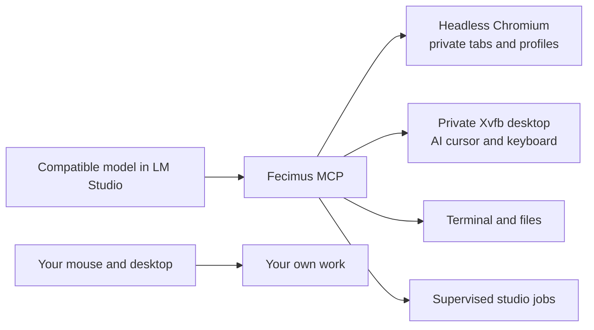

# Fecimus MCP

**One integration. An AI workspace that lets you keep working.**

Fecimus connects a tool-capable model to a background browser, an independent Linux
desktop, application/window controls, screenshots, mouse, keyboard, terminal,
and files. Version **2.1.0 exposes 84 tools through one `mcp/fecimus` switch** in LM Studio:
all 79 previous tools, two desktop workflow helpers, and three studio job tools.
The model runs in your chosen host; Fecimus does not bundle or lock you to a model.



## What works

- **Keep using your computer.** AI input targets a separate desktop and headless
  browser, without moving your physical pointer or focusing your windows.
- **Read background tabs.** Extract loaded text beyond the viewport, take full-page
  screenshots, and scrape up to eight URLs with three concurrent page loads.
- **Combine desktop work.** `fecimus_desktop_state` returns window/input state and an
  optional screenshot. `fecimus_desktop_actions` validates and runs up to 12 actions
  in one serialized batch, stopping at the first failure. Browser snapshots return
  usable element refs inline. See [performance measurements](docs/PERFORMANCE.md).
- **Run longer tasks.** `fecimus_job_start`, `fecimus_job_status`, and `fecimus_job_cancel`
  supervise commands, report bounded logs, and handle timeouts without holding a
  model tool call open for the entire render or build.
- **Recover honestly.** Validate arguments, apply defaults, serialize conflicting
  input, reconnect disconnected backends, and return partial scrape failures.
  A dispatched action is never automatically replayed.
- **Keep one integration.** Browser, vision, input, apps and file tools share a
  single registration. Existing backend programs are internal components.

## Supported installation targets

| Host | How Fecimus runs | Validation status |
| --- | --- | --- |
| Ubuntu 22.04 / 24.04 / 26.04 LTS and declared derivatives, including Linux Mint XFCE | Native Linux process with a private Xvfb desktop | End-to-end tested on Linux Mint 22.3, Ubuntu 24.04 base |
| Windows 11 Pro / Pro N, x64 or ARM64 | Windows LM Studio launches Fecimus inside **WSL2 Ubuntu LTS** | Installer and platform checks provided; no Windows 11 end-to-end hardware run yet |

Other Windows editions, Windows 10, macOS, WSL1, and non-Ubuntu-based Linux are
outside this release's installation policy. Windows support means a private
**Linux** AI desktop inside WSL2; it does not provide a second pointer controlling
existing native Windows application windows. See [platform details](docs/PLATFORMS.md).

## Download and install

| Platform | Release archive | After extracting the complete archive |
| --- | --- | --- |
| Ubuntu LTS / Linux Mint XFCE | [Fecimus 2.1.0 for Linux](https://github.com/NermalYT/fecimus/releases/download/v2.1.0/Fecimus-2.1.0-Linux-Ubuntu-LTS.tar.gz) | Read `START_HERE.md`; run `bash INSTALL_FECIMUS.sh` in a terminal |
| Windows 11 Pro / Pro N | [Fecimus 2.1.0 for Windows through WSL2](https://github.com/NermalYT/fecimus/releases/download/v2.1.0/Fecimus-2.1.0-Windows-11-Pro-WSL2.zip) | Read `START_HERE.md`; run `INSTALL_FECIMUS.cmd` |

The archives contain the same Fecimus source and tools with different starter
documents and launchers. Compare downloads with the release's
[SHA256SUMS](https://github.com/NermalYT/fecimus/releases/download/v2.1.0/SHA256SUMS).
Each archive includes an extraction-verified file manifest. Dependencies and
models are not bundled; initial setup needs internet access.

Linux needs Python 3, curl, and xz utilities. Windows needs an initialized WSL2
Ubuntu LTS distribution with an ordinary Linux user and those same prerequisites
inside it; the default distribution name is `Ubuntu-24.04`. WSL installation may
require a Windows restart before running Fecimus setup. Follow the
[Linux starter](platform/Linux/README.md) or [Windows starter](platform/Windows/README.md).

The launchers stage a fresh installed source copy, install dependencies, verify
MCP startup, and print the LM Studio configuration backup. They replace the six
original Fecimus registrations while retaining unrelated integrations. Then restart
LM Studio, load a compatible model, and enable **mcp/fecimus** in the chat.
LM Studio's per-tool permission prompts remain its own setting.

## Install from source on Linux

Install Git, Python 3, curl, and xz utilities, then:

```bash
git clone https://github.com/NermalYT/fecimus.git
cd fecimus
bash scripts/install.sh --system-deps --replace-legacy
```

The installer can provision a private Node.js 22 runtime if needed. The explicit
`--system-deps` option installs Linux packages through `sudo`; omit it when those
dependencies already exist. Node/npm dependencies and Chromium are installed
locally. Startup is checked before the LM Studio configuration is changed.
`--replace-legacy` removes the six earlier Fecimus registrations; unrelated servers
are retained. A configuration backup is printed.

This direct source installation registers the checkout's absolute path; keep it
in place. The release launcher instead installs a fresh copy outside Downloads.

## Install from source on Windows 11 Pro

Install and initialize **WSL2 with Ubuntu LTS**, and install Git on Windows.
Clone this repository, then run from its folder in PowerShell:

```powershell
powershell -NoProfile -ExecutionPolicy Bypass -File scripts/install.ps1 -Distribution Ubuntu-24.04 -InstallSystemDeps -ReplaceLegacy
```

The script checks Windows edition/build and WSL2, copies source into the selected
Linux distribution, installs there, and registers one Windows LM Studio entry
using `wsl.exe`. It does not enable Windows features or reboot the computer.
The process-level execution-policy flag does not change the machine's policy.
See [the Windows setup and limitations](docs/PLATFORMS.md).

## Pick a model

Start with the [38-model compatibility and selection guide](docs/MODELS.md), or
use the [machine-readable catalog](docs/models.json). It distinguishes documented
runtime support, vision capabilities, and unverified candidates. **The listed
models have not been benchmarked or certified against Fecimus.**

A text tool model can read DOM snapshots, scrape pages, and work with files.
Screenshot interpretation needs a vision-capable model and a host/runtime that
passes image tool results correctly. The exact quantization, tool template,
runtime version, available memory and context size all matter.

Test a loaded model's basic function-calling behavior without giving it real
computer tools:

```bash
node scripts/check-model.mjs --model "YOUR_EXACT_LOADED_MODEL_ID"
```

This requires the local LM Studio API server. It checks a harmless synthetic
function call, not visual reasoning or autonomous task competence.

## Studio workflows and validation

Use [the studio guide](docs/STUDIO.md) for project roots, shared drives, Blender
scripts/renders, Unity batch-job templates, and simultaneous editing. Jobs default
to two concurrent jobs with lower CPU scheduling priority where available;
they do not enforce memory or GPU limits and stop when Fecimus shuts down.

Blender **4.5.13 LTS** was exercised on Linux Mint 22.3: a small 64×64 Cycles **CPU**
render produced PNG and `.blend` files; the GUI opened the scene on Fecimus's private
display, its fully painted interface was inspected, and cleanup was verified.
This establishes a basic workflow on that machine, not production-scene speed or
GPU acceleration. Unity, native Windows GUI control, and Windows/WSL graphics
remain untested. See [validation details](docs/STUDIO.md#graphics-and-validation).

## Important behavior

Fecimus reads **its own** browser tabs and private desktop. It does not automatically
attach to your personal browser, reveal unrendered/lazy-loaded content, or make
minimized native windows readable. Launch native apps with `application_launch`
for separate application profiles. Save private-desktop work before disabling or
restarting Fecimus; those applications close with the session.
An observed window can still be painting or initializing; inspect it before
issuing input. Private application HOME also means host licenses, preferences,
plugins, and Git/SSH credentials may require separate setup. The Xvfb desktop does
not guarantee accelerated 3D graphics.

The separate cursor is an input boundary, **not a filesystem security sandbox**.
Terminal and file tools retain your user's file access; browser sessions retain
cookies in their own profiles. Some native applications implement their own
singleton mechanisms. Review [security and access boundaries](SECURITY.md).

## Configuration and diagnostics

Private data defaults to `~/.local/share/fecimus`, outside the repository.
`FECIMUS_DATA_DIR` selects another directory. Optional `settings.json` in that folder:

```json
{
  "desktop": { "width": 1600, "height": 1000 },
  "studio": { "max_concurrent_jobs": 2 },
  "snapshot_max_chars": 16000,
  "startup_timeout_ms": 15000,
  "call_timeout_ms": 180000,
  "debug": false
}
```

Use `fecimus_status` for connections, queues, call timing and private-display health.
`{"reconnect":true}` reconnects unavailable backends without replaying actions.
Use the short snapshot ref in browser arguments, such as `{"target":"e12"}`.

```bash
npm run test:unit
npm run test:integration
node scripts/install.mjs --check
```

Integration tests additionally need a C compiler and X11 headers (`build-essential`
and `libx11-dev` on Ubuntu). They use local HTTP fixtures, temporary files, private
X11 input, and isolated browser profiles. They verify full-page capture, hidden
content, partial scrape failures, default arguments, recovery, independent
application HOME, profile leases, and process cleanup. They do not benchmark LLMs.

## Contribute

See [CONTRIBUTING.md](CONTRIBUTING.md), [security reporting](SECURITY.md), and the
issue templates. [MIT licensed](LICENSE). Dependencies and model weights retain
their own licenses. No model weights, browser profiles, personal configuration,
or compiled system packages are included in this repository.
